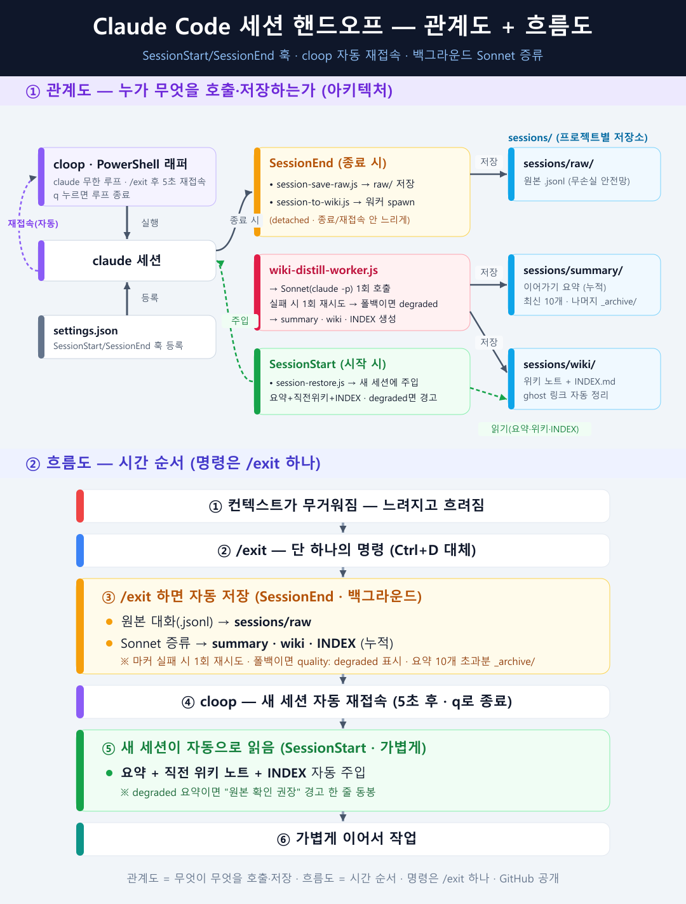

# Claude Code Session Handoff — 컴팩트 대신 `/exit` 하나로

> AI와 길게 작업할 때 컨텍스트가 가득 차 느려지는 문제를, **컴팩트(압축) 대신
> 기억을 파일로 저장하고 가볍게 새 세션으로 다시 시작**하는 방식으로 해결합니다.
> 명령은 단 하나 — **`/exit`**. 나머지는 전부 자동.

**English TL;DR** — Instead of letting Claude Code *compact* (slow & lossy), this saves the
session on exit and re-injects a light handoff on the next start. One command: `/exit`.
On exit it auto-saves the **raw transcript**, and a background Sonnet call writes a **handoff
summary**, a **wiki note** (`[[links]]`), and updates an **INDEX**. On the next start it
auto-injects the latest summary + last wiki note + index. Built from `SessionEnd` /
`SessionStart` hooks + a PowerShell auto-reconnect loop (`cloop`).



---

## 동작 흐름 (명령은 `/exit` 하나)

```
[컨텍스트 무거워짐]
   │  /exit            (Ctrl+D 대체 / cloop이면 자동 반복)
   ▼  SessionEnd (자동)
   ├─ session-save-raw.js   → 원본 대화(.jsonl)  → sessions/raw/
   └─ session-to-wiki.js    → 백그라운드 Sonnet 1회:
         · 이어가기 요약  → sessions/summary/   (누적)
         · 위키 노트      → sessions/wiki/       (누적, [[링크]])
         · INDEX.md       → sessions/wiki/INDEX.md (한 줄 설명 자동 갱신)
   │  cloop 자동 재접속
   ▼  SessionStart (자동)
   └─ session-restore.js → 새 세션에 주입:
         ① 최신 이어가기 요약(전체)  ② 직전 위키 노트 본문(전체)  ③ INDEX.md
   ▼
[가볍게 이어서 작업]
```

| 효과 | 설명 |
|---|---|
| ⚡ 빠름 | 컨텍스트를 항상 가볍게 유지 |
| 💾 영구 보존 | 요약·위키·원본 모두 파일로 누적 (안 사라짐) |
| 💰 비용 절감 | 새 출발은 요약+인덱스만 읽음 |
| 🧠 지식 축적 | 위키 노트 + INDEX로 옵시디언 지식 그물 |

## 노트 3종

| 종류 | 폴더 | 내용 | 새 세션이 읽나 |
|---|---|---|---|
| 이어가기 요약 | `sessions/summary/` | 한 일 / 현재 상태 / 다음 할 일 | ✅ 최신 1개(전체) |
| 위키 노트 | `sessions/wiki/` | 지식·결정 + `[[링크]]` | ✅ 직전 1개(본문) |
| 인덱스 | `sessions/wiki/INDEX.md` | 노트별 한 줄 설명 | ✅ 전체(지식 지도) |
| 원본 | `sessions/raw/` | 대화 `.jsonl` 통째 | ❌ 필요할 때만 |

자세한 설명: [`docs/세션훅_설명서.md`](docs/세션훅_설명서.md)

> 📍 **저장 위치 = git 루트**: `sessions/`는 `claude`를 켠 폴더(cwd)의 **git 루트**에 생성됩니다(`gitRootOf(cwd)` — `lib-project-dir.js`). 하위 폴더에서 켜도 한 곳으로 모입니다(예: `C:\repo\sub`에서 켜도 핸드오프는 `C:\repo\sessions\`). **저장 훅과 복원 훅이 모두 같은 `gitRootOf(cwd)`를 쓰므로 항상 같은 곳을 읽고 씁니다.** git repo가 아닌 폴더(예: Desktop)에서 켜면 cwd로 폴백.

> 🛟 **백필 안전망**: `/exit` 실패·크래시·백그라운드 작업 중 종료 등으로 `SessionEnd`가 안 떠 저장이 누락돼도, 다음 세션 시작 시 자동 복구합니다. `SessionStart`가 먼저 `stat`만으로(내용 안 읽음) "새 미저장 세션이 있는지" 싸게 확인하고(정상 종료 시엔 즉시 통과 → 상시 비용 0), 누락이 감지될 때만 원본을 `sessions/raw/`에 복사(멱등)하고 미요약 최신 1개를 백그라운드 증류합니다.

---

## 설치 (Windows + PowerShell)

> Node.js(`node`)가 PATH에 있어야 하고, Claude Code 로그인(OAuth)이 돼 있어야 합니다.
> 경로의 `<사용자명>` 은 본인 환경에 맞게 바꾸세요.

### 1) 훅 스크립트 배치
`hooks/` 의 5개 파일을 `C:\Users\<사용자명>\.claude\hooks\` 로 복사:
`session-save-raw.js` · `session-restore.js` · `session-to-wiki.js` · `wiki-distill-worker.js` · `lib-project-dir.js`

> `lib-project-dir.js` 는 저장 위치를 git 루트로 결정하는 `gitRootOf` 헬퍼(세 훅 모두 require). 빠뜨리지 말고 함께 복사하세요.

### 2) settings.json 병합
`~/.claude/settings.json` 의 `"hooks"` 에 [`settings.example.json`](settings.example.json) 의
`SessionStart` / `SessionEnd` 블록을 병합.

### 3) 재접속 래퍼(`cloop`) 등록
`powershell/profile-snippet.ps1` 의 `cloop` 함수를 PowerShell 프로필
(`$PROFILE.CurrentUserAllHosts`)에 추가. 새 PowerShell 창부터 적용.

---

## 사용법

```text
1) 프로젝트 폴더에서:  cloop
2) 무거워지면:  /exit        → 원본+요약+위키+INDEX 자동 저장(백그라운드)
3) 자동 재접속 → 새 세션이 [요약 + 직전 위키 + INDEX] 읽고 이어감
4) 완전히 끝낼 때:  /exit 후 5초 안에  q
```

- 세션 나가기: `/exit` 또는 `/quit` (Ctrl+D 대체)
- 루프 종료: 종료 후 5초 안에 `q` (Ctrl+C 대체)

---

## 동작 메모 / 한계

- 컴팩트 경고가 *뜨는 순간*은 훅으로 못 잡습니다(순수 UI). 트리거는 사용자가 `/exit` 치는 것.
- 훅(셸 스크립트)은 요약을 직접 못 함 → 요약·위키는 **백그라운드 `claude -p`(Sonnet)** 가 생성(비차단).
- 워커 인증: 잘못된 `ANTHROPIC_API_KEY` 제거 후 OAuth 사용.
- 재귀 방지: 워커가 띄운 세션은 `CLAUDE_WIKI_CHILD` 로 훅 no-op.
- Sonnet 출력 분리: `@@@TITLE@@@` / `@@@HANDOFF@@@` / `@@@WIKI@@@` 줄단위 마커.
- 품질 자기검증: 마커 부족·빈 출력·타임아웃이면 **1회만 재시도**, 그래도 실패하면 폴백 + frontmatter에 `quality: degraded` 기록. 새 세션 복원 시 degraded면 "원본 확인 권장" 경고 한 줄을 함께 띄움.
- 요약 retention: `summary/` 는 최신 10개만 두고 나머지는 `summary/_archive/` 로 **이동(삭제 아님)**. 개수는 워커의 `SUMMARY_KEEP` 상수로 조정.
- INDEX 정합성: 갱신 시 실제 파일이 없는 `[[링크]]`(ghost)는 자동 제거(파일 자체는 안 건드림). 미색인 파일(orphan)은 로그만 남김.
- 저장 위치 = `gitRootOf(cwd)` (켠 폴더의 git 루트). 저장 2훅과 복원 1훅이 동일 기준 → 항상 같은 곳을 읽고 씀. 비-git 폴더는 cwd 폴백.
- 백필 안전망: `SessionEnd`가 안 떠도(크래시·강제종료 등) 다음 `SessionStart`에서 누락 세션의 raw 복사 + 미요약 최신 1개 증류. 싼 게이트(`stat`만)로 정상 종료 시엔 비용 0(스캔 안 함).
- macOS/Linux는 `cloop`을 bash/zsh 함수로, 경로를 `~/.claude/...` 로 바꾸면 동일하게 동작.

## License
MIT — see [LICENSE](LICENSE).
